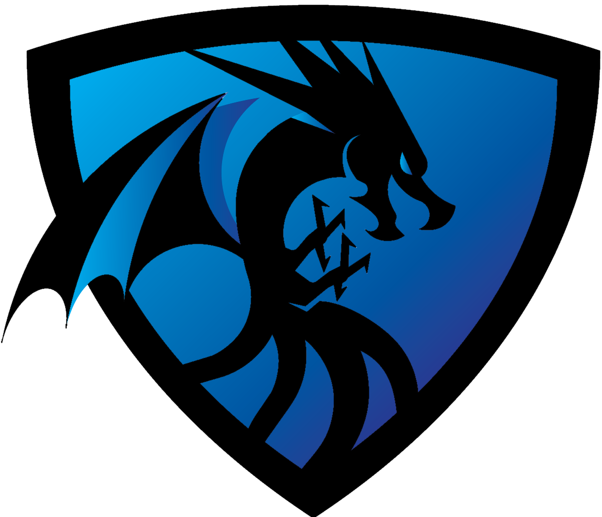

# Typhon

Python Rocket League bot using the RLBot framework. The base of the bot was started from this [template](https://github.com/RLBot/RLBotPythonExample).

## Changing the bot

- Bot behavior is controlled by `src/bot.py`
- Bot appearance is controlled by `src/appearance.cfg`

See https://github.com/RLBot/RLBotPythonExample/wiki for documentation and tutorials.

